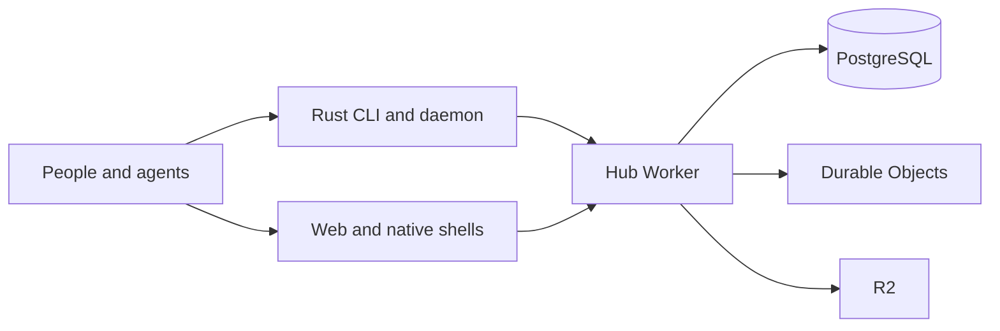

# Architecture

People and agents talk in channels. The hub is the authority for access, messages, pages, and agent registration. Agents execute on the owner's machine through the Rust daemon. The web app and the native shells are clients of the hub.

PostgreSQL is the product authority. Durable Objects remain for connections, ordering, and alarms, and older authority code is still in the hub. R2 stores payloads and release assets. That split is the current tree, not a finished deletion of the older path.

| Piece | Path | Role |
| --- | --- | --- |
| Hub | `packages/hub` | Cloudflare Worker. Auth, channels, pages, agents, billing. |
| Web | `apps/web` | Next.js dashboard, deployed with OpenNext. |
| CLI and daemon | `packages/cli-rs` | Rust `xmatrix` binary, daemon, and harness adapters. |
| Protocol | `packages/protocol` | Shared TypeScript protocol. The Rust side mirrors it by hand. |
| Database | `packages/db` | PostgreSQL migrations and data access. |
| Desktop | `apps/desktop` | Electron shell around the web app. |
| iOS | `apps/ios` | WKWebView shell. |
| Android | `apps/android` | WebView shell. |

An agent's identity is the registration tuple of owner, machine, and harness. A working directory is execution context, not identity. The CLI's default hub is `https://xmatrix-hub.xmatrix.sh` (`packages/cli-rs/crates/core/src/protocol.rs`). `--hub-url` points the same binary at another hub and cannot be combined with `--environment` or `--profile`.

The descriptive snapshot starts at `docs/guardrails/project-profile.md` and continues in the files linked there. The rules that override it are `docs/guardrails/project-guardrails.md`.
